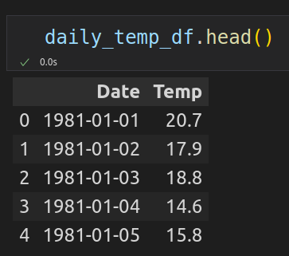
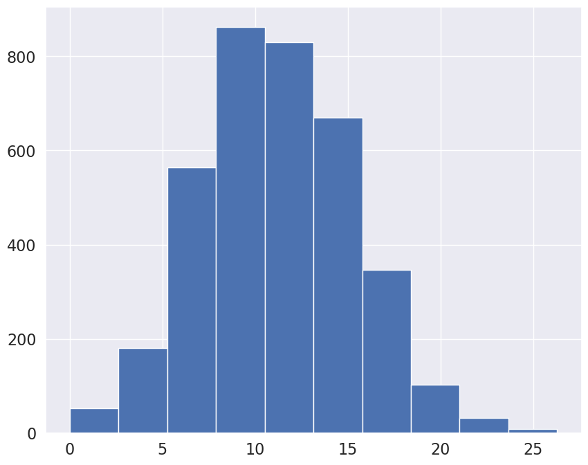
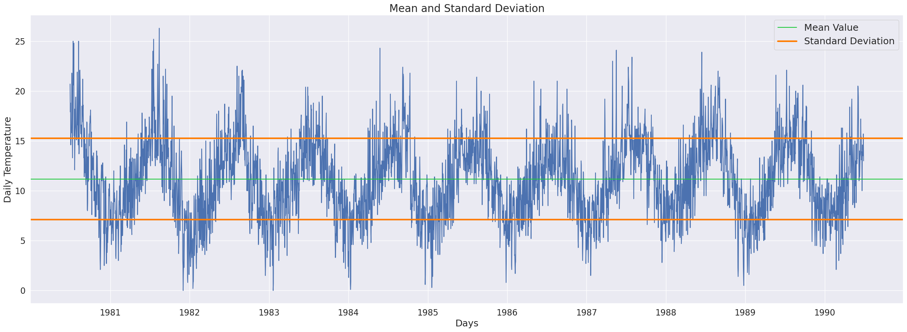
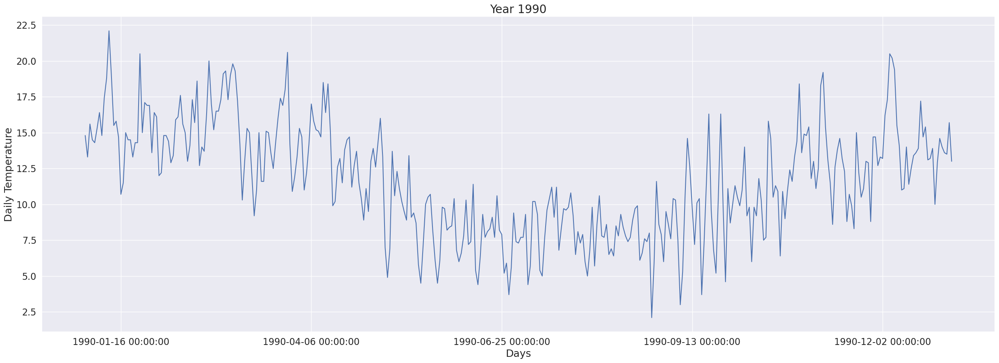
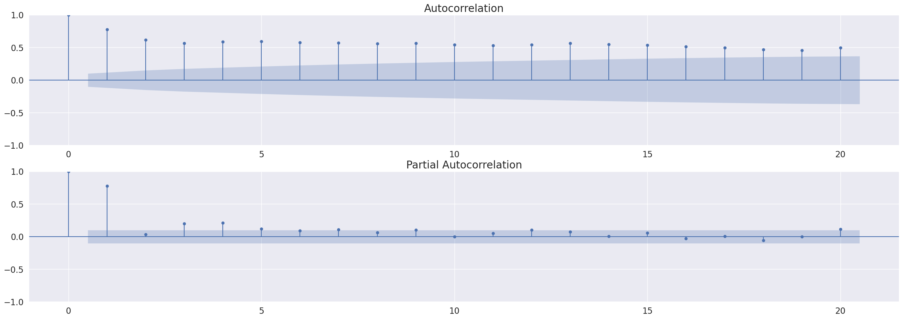
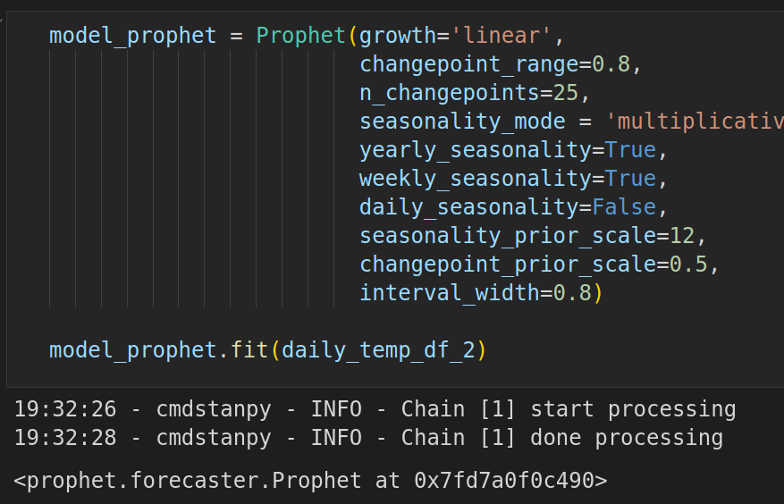
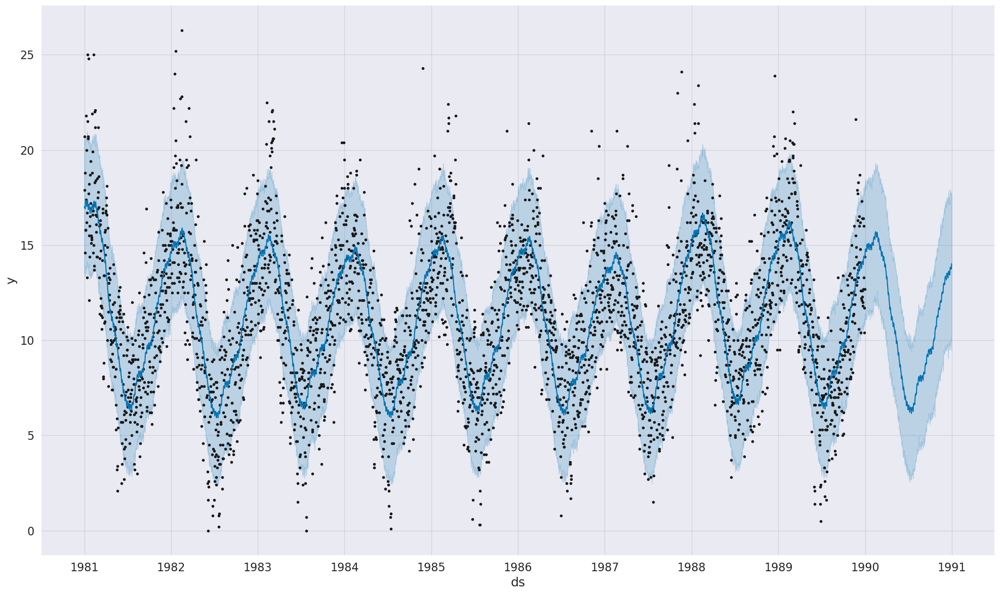
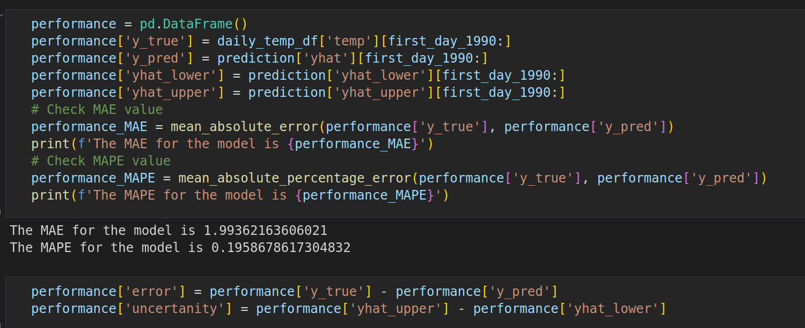
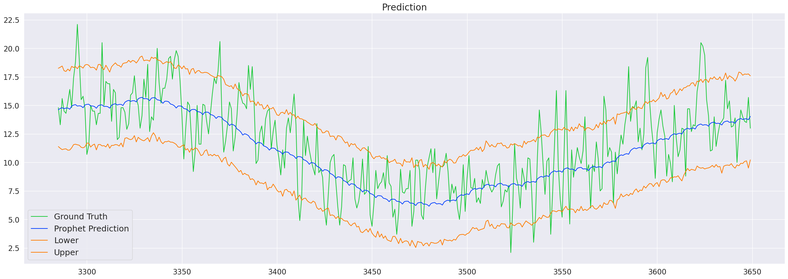
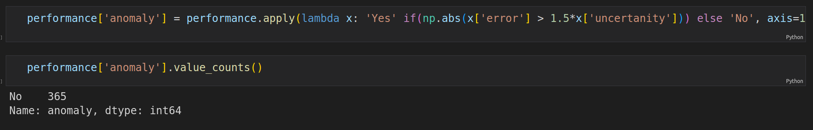

# Daily_temperature_forecasting_using_FB_Prophet

Forecasting with Facebook Prophet for anomaly detection .

# Minimum Daily Temperatures Dataset

This dataset describes the minimum daily temperatures over 10 years (1981-1990) in the city Melbourne, Australia.

The units are in degrees Celsius and there are 3650 observations. The source of the data is credited as the Australian Bureau of Meteorology.

Dataset has two columns: Date and Temp.

Let's plot a histogram of temperature distribution.

Also let's take a look at mean value and standard deviation of the data.

In this project we will use data for only one year. Let's plot it.

# Autocorrelation and partial autocorrelation

Below is a plot of the autocorrelation and partial autocorrelation.

# Model Training

Let's train the model with the following parameters.

Now we can make a prediction and plot it.

# Anomaly detection

To detect anomalies we need to calculate our model's errors and confidence intervals. If error is bigger than 1.5*(uncertanity) that is anomaly.

Plot prediction and uncertanity interval.

In our case all observations are normal.

